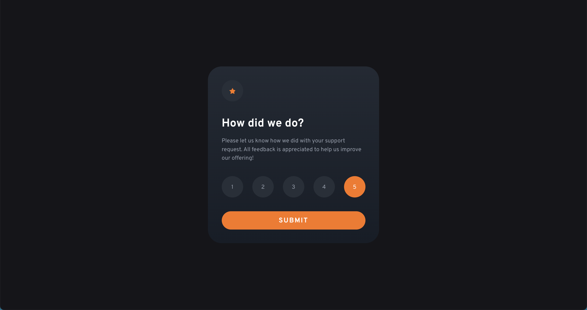
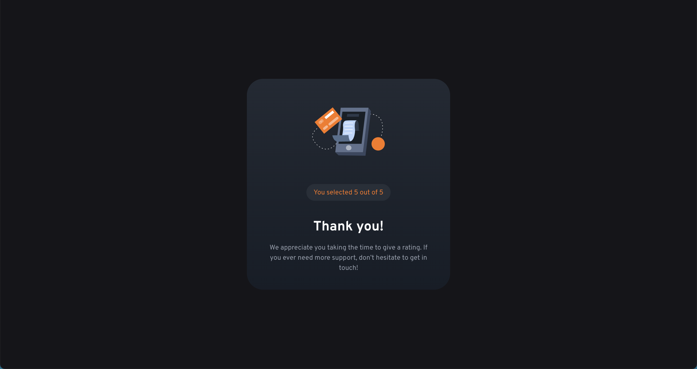

# 🚀 Interactive Rating Component

This is a solution to the [Interactive Rating Component challenge on Frontend Mentor](https://www.frontendmentor.io/challenges/interactive-rating-component-koxpeBUmI). Frontend Mentor challenges help you improve your coding skills by building realistic projects.

--- 

## ✅ Table of contents

- [Overview](#-overview)
    - [The challenge](#the-challenge)
    - [Screenshots](#screenshots)
    - [Links](#links)
- [My process](#-my-process)
    - [Built with](#built-with)
    - [What I learned](#what-i-learned)
    - [Useful resources](#useful-resources)
- [Author](#-author)

---

## 💡 Overview

### The challenge

Users should be able to:

- View the optimal layout for the app depending on their device's screen size
- See hover states for all interactive elements on the page
- Select and submit a number rating
- See the `Thank you` card state after submitting a rating

### Screenshots

 
  
  <em>active state</em>

 
  
  <em>submitted state</em>

### Links

- Solution URL: [GitHub](https://github.com/jakubjirous/interactive-rating-component)
- Live Site URL: [Vercel](https://interactive-rating-component-jakubjirous.vercel.app/)

---

## 🎯 My process

### Built with

- Semantic HTML5 markup
- CSS custom properties
- Flexbox
- CSS Grid
- Mobile-first workflow
- [React](https://reactjs.org/) – JS library
- [Next.js](https://nextjs.org/) – React framework
- [Chakra UI](https://chakra-ui.com/) – For styles

### What I learned

In this code challenge, I learned how to work with Chakra UI, a React component library that provides pre-styled UI components. I gained an understanding of its concepts, such as components, styles, and themes. 

The main takeaway for me was learning how to create a foundation for larger scale projects using Chakra UI as a starter point, particularly when using custom theming. This knowledge will be valuable for future projects as I can use Chakra UI to efficiently create UIs, and focus more on the functional aspects of my application.

### Useful resources

- [Next.js Documentation](https://beta.nextjs.org/docs)
- [React Documentation](https://beta.reactjs.org/)
- [Chakra UI Documentation](https://chakra-ui.com/getting-started)

---

## 👨‍💻 Author

- Website – [www.jakubjirous.cz](https://www.jakubjirous.cz)
- Frontend Mentor – [@jakubjirous](https://www.frontendmentor.io/profile/jakubjirous)
- LinkedIn – [jakubjirous](https://www.linkedin.com/in/jakubjirous/)
